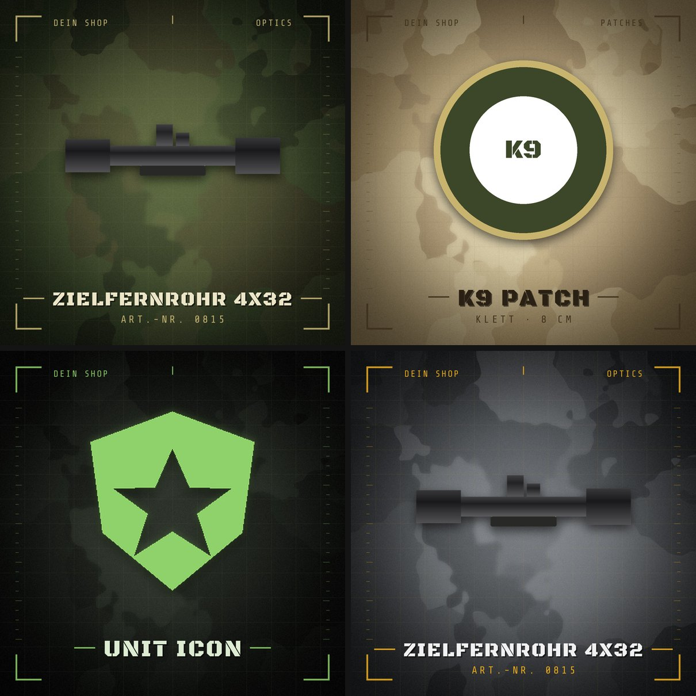

# ProductCon

Macht aus beliebigen Bildern und Icons **einheitliche Produktbilder im Military-Look**:
Du gibst ein Bild rein – ProductCon stellt das Motiv frei, skaliert es immer auf die
gleiche Größe und setzt es mittig auf immer denselben Hintergrund (Tarnmuster, Raster,
Eckrahmen, optional Titel und Shopname).



## Was passiert mit jedem Bild?

1. **Freistellen** – PNGs mit Transparenz werden direkt übernommen. Bei Bildern mit
   einfarbigem Hintergrund (z.B. weiß) wird dieser automatisch entfernt. Weiße Flächen
   *im* Produkt bleiben erhalten, und an den Kanten entsteht kein heller Saum.
2. **Zuschneiden** – leere Ränder werden abgeschnitten.
3. **Einpassen** – das Motiv wird immer in die gleiche Fläche eingepasst und zentriert,
   egal wie groß das Original ist (16-px-Icon oder 6000-px-Foto).
4. **Hintergrund** – immer derselbe (gleicher Seed = pixelgleiches Tarnmuster),
   inkl. Schlagschatten unter dem Motiv.
5. **Texte** (optional) – Titel in Stencil-Schrift, Untertitel, Shopname oben links,
   Kategorie oben rechts.

## Windows-EXE (ohne Python)

Fertige `ProductCon.exe` herunterladen:

1. Im GitHub-Repo auf **Actions → „Windows-EXE bauen“** gehen, den neuesten
   erfolgreichen Lauf öffnen und unten bei *Artifacts* **ProductCon-Windows** laden
   (dauerhafte Downloads liegen unter **Releases**).
2. ZIP entpacken. Der Ordner enthält `ProductCon.exe`, `productcon.json`,
   `input/`, `beispiele/` und eine `LIESMICH.txt`.
3. Bilder in `input/` legen und `ProductCon.exe` doppelklicken – oder Bilder bzw.
   Ordner direkt auf die EXE ziehen. Die Ergebnisse landen in `output/`, der Ordner
   öffnet sich am Ende automatisch.

`input/`, `output/` und `productcon.json` werden immer **neben der EXE** gesucht, egal
von wo sie gestartet wird. Das Aussehen änderst du in `productcon.json` mit dem Editor.

Hinweise:
- Die EXE ist nicht signiert. Windows SmartScreen fragt deshalb beim ersten Start
  nach: *Weitere Informationen → Trotzdem ausführen*.
- Die KI-Freistellung (`--remove-bg ai`) ist in der EXE nicht enthalten (das Modell wäre
  zu groß). Dafür die Python-Version verwenden.
- Aus der Eingabeaufforderung: `ProductCon.exe --help`. Mit `--no-pause` wartet sie am
  Ende nicht auf Enter und öffnet keinen Ordner (für Skripte).

**EXE selbst bauen** (unter Windows):

```bash
pip install -r requirements.txt pyinstaller
pyinstaller --noconfirm packaging/ProductCon.spec
# → dist/ProductCon.exe
```

Jeder Push baut die EXE über GitHub Actions automatisch neu
(`.github/workflows/build-exe.yml`). Ein neues Release mit der ZIP-Datei entsteht, wenn du
einen Tag wie `v1.0.1` pushst – oder unter **Actions → „Windows-EXE bauen“ → Run workflow**
bei *release_tag* eine Versionsnummer einträgst.

## Installation (Python-Version)

Voraussetzung: [Python](https://www.python.org/downloads/) ab 3.9.

```bash
pip install -r requirements.txt
```

## Schnellstart

**Windows mit Python:** Bilder einfach per Drag & Drop auf **`ProductCon.bat`** ziehen – oder Bilder
in den Ordner `input/` legen und `ProductCon.bat` doppelklicken. Die fehlenden Pakete
werden beim ersten Start automatisch installiert. Die Ergebnisse landen in `output/`.

**Kommandozeile (alle Systeme):**

```bash
# alle Bilder aus ./input verarbeiten → ./output
python -m productcon

# einzelne Dateien oder Ordner
python -m productcon foto.jpg icons/ -o fertig/

# mit Texten: {name} = Dateiname, {index} = laufende Nummer
python -m productcon input/ --title "{name}" --subtitle "Art.-Nr. {index:04d}" --brand "Mein Shop"

# anderes Theme, Querformat, PNG
python -m productcon input/ --theme desert --size 1920x1080 --format png

# schwarze Icons auf dunklem Hintergrund sichtbar machen
python -m productcon icons/ --tint "#c9b877"      # Icon einfärben
python -m productcon icons/ --glow 0.4            # oder Lichtkante

# Beispiele im Repo ausprobieren
python -m productcon examples/ --title "{name}"
```

Alle Optionen: `python -m productcon --help`

## Themes

| Theme      | Look                                              |
|------------|---------------------------------------------------|
| `woodland` | Olivgrün / Braun – klassisches Flecktarn (Standard) |
| `desert`   | Sand / Khaki – Wüstentarn                         |
| `night`    | Fast schwarz mit Nachtsicht-Grün – Black Ops      |
| `urban`    | Grautöne mit Warngelb                             |

Mit `--seed 42` bekommst du eine andere (aber wieder feste) Variante des Tarnmusters.

## Immer gleiche Einstellungen: `productcon.json`

Liegt im Arbeitsordner eine `productcon.json`, wird sie automatisch geladen – so sieht
jedes Bild gleich aus, ohne dass du Optionen tippen musst. Kommandozeilen-Optionen
überschreiben die Datei. Deine aktuellen Optionen kannst du so abspeichern:

```bash
python -m productcon --theme night --brand "Mein Shop" --title "{name}" --save-config productcon.json
```

| Einstellung      | Standard   | Bedeutung |
|------------------|------------|-----------|
| `width`, `height`| `2000`     | Ausgabegröße in Pixeln (`--size 2000` oder `--size 1600x1200`) |
| `theme`          | `woodland` | Farbthema (siehe oben) |
| `background`     | `null`     | Pfad zu eigenem Hintergrundbild statt des generierten |
| `seed`           | `1337`     | Variante des Tarnmusters |
| `camo_strength`  | `0.55`     | Stärke des Tarnmusters (0 = nur Verlauf) |
| `grid`, `frame`  | `true`     | Raster bzw. Eckrahmen/Skalen anzeigen |
| `scale`          | `0.8`      | Wie viel der Produktfläche das Motiv ausfüllt (0–1) |
| `remove_bg`      | `auto`     | Hintergrund entfernen: `auto`, `on`, `off`, `ai` (siehe unten) |
| `tolerance`      | `40`       | Wie stark Pixel von der Hintergrundfarbe abweichen dürfen |
| `tint`           | `null`     | Motiv einfarbig einfärben, z.B. `"#c9b877"` (für Icons) |
| `shadow`         | `true`     | Schlagschatten |
| `shadow_opacity` | `0.6`      | Deckkraft des Schattens |
| `glow`           | `0`        | Lichtkante um das Motiv (0–1), gut für dunkle Motive |
| `title`          | `null`     | Titel unter dem Motiv – Platzhalter `{name}`, `{index}`, `{date}` |
| `subtitle`       | `null`     | Untertitel, z.B. `"Art.-Nr. {index:04d}"` |
| `brand`          | `null`     | Kleiner Text oben links (Shopname) |
| `tag`            | `null`     | Kleiner Text oben rechts (Kategorie) |
| `title_font`     | `null`     | Eigene `.ttf`/`.otf` für den Titel |
| `format`         | `jpg`      | `jpg`, `png` oder `webp` |
| `quality`        | `92`       | Qualität für jpg/webp |

## Hintergrund entfernen (`--remove-bg`)

| Modus  | Verhalten |
|--------|-----------|
| `auto` | Transparente PNGs bleiben wie sie sind. Sonst wird ein **einfarbiger** Hintergrund (weiß, grau, …) entfernt. Ist der Hintergrund unruhig (normales Foto), bleibt das Bild rechteckig. |
| `on`   | Einfarbigen Hintergrund immer entfernen. |
| `off`  | Nie etwas entfernen. |
| `ai`   | Freistellung per KI – funktioniert auch bei Fotos mit beliebigem Hintergrund. Benötigt einmalig `pip install "rembg[cpu]"`; das Modell (~170 MB) wird beim ersten Aufruf automatisch geladen. |

Tipp: Bleiben Reste vom Hintergrund stehen, `--tolerance` erhöhen (z.B. 60).
Frisst die Freistellung helle Produktkanten weg, `--tolerance` senken (z.B. 25).

## Eigener Hintergrund

```bash
# generierten Hintergrund exportieren, z.B. um ihn in Photoshop mit Logo zu versehen
python -m productcon --export-background mein_hintergrund.png

# danach immer diesen Hintergrund verwenden
python -m productcon input/ --background mein_hintergrund.png
```

Eigene Hintergründe werden automatisch auf die Ausgabegröße zugeschnitten.

## Unterstützte Formate

Eingabe: PNG, JPG, WebP, BMP, GIF, TIFF, ICO. SVG bitte vorher als PNG exportieren.
Ausgabe: JPG (Standard), PNG, WebP.

## Als Python-Bibliothek

```python
from productcon import Settings, load_image, prepare_product, render_background, compose

settings = Settings(theme="desert", width=1500, height=1500)
product, info = prepare_product(load_image("foto.jpg"))
bild = compose(render_background(settings, brand="Mein Shop"), product, settings, title="Feldflasche")
bild.save("feldflasche.jpg", quality=92)
```

## Entwicklung

```bash
pip install -e ".[dev]"
pytest
```

## Lizenzen der Schriften

Mitgeliefert werden die Schriften *Black Ops One* und *Share Tech Mono*
(SIL Open Font License 1.1, siehe `productcon/fonts/OFL.txt`). Fehlen sie, wird eine
Systemschrift verwendet.
